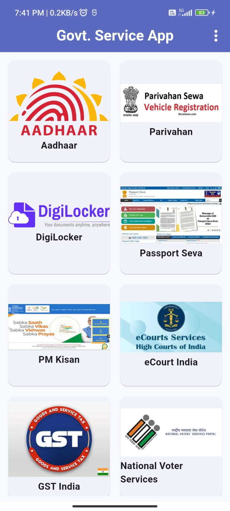
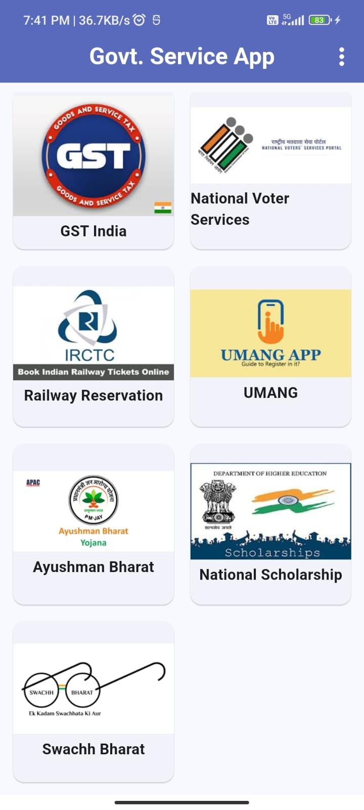
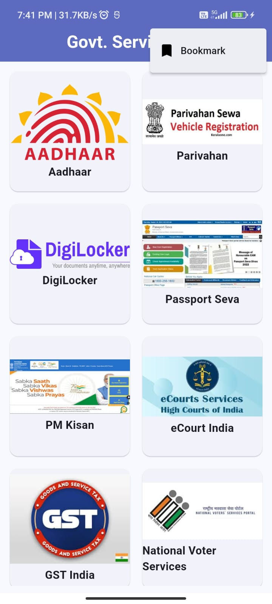
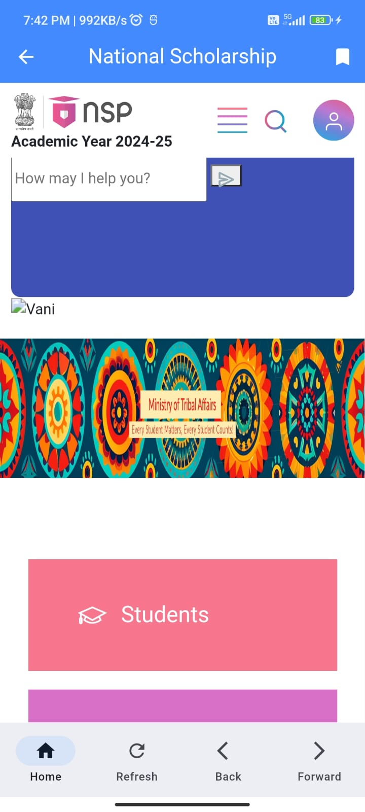
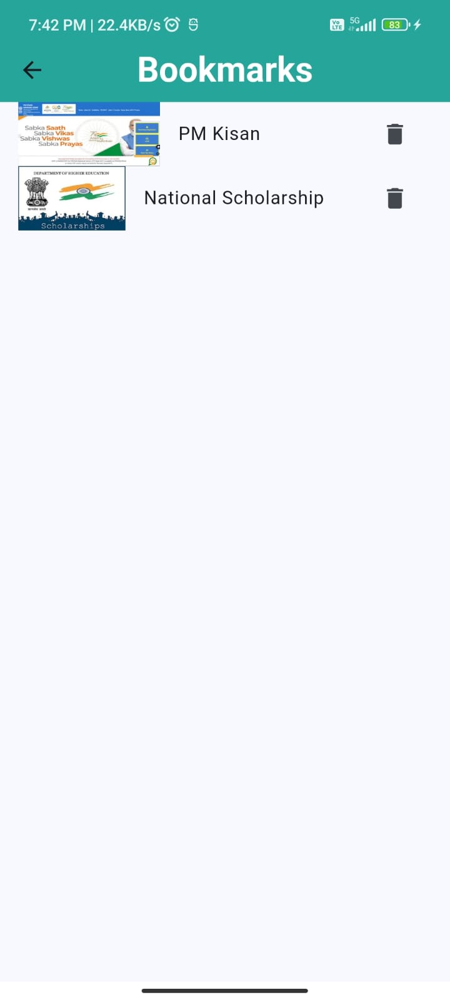

# Government Service App

Welcome to the **Government Service App**! This app is designed to provide easy access to various government websites, all within a single platform. Built using Flutter, it utilizes the **InAppWebViewController** for seamless web navigation.

---

## Features

- Access multiple government websites directly from the app.
- Smooth and fast browsing experience using `InAppWebView`.
- User-friendly interface with intuitive navigation.
- Lightweight and efficient performance.

---

## Screenshots












---

## Installation

### Prerequisites
- Flutter SDK installed on your machine ([Get Flutter](https://flutter.dev/docs/get-started/install)).
- A device or emulator for testing.

### Steps to Install
1. Clone this repository:
   ```bash
   git clone https://github.com/Vishakha1510/Government_Service_App.git
   ```
2. Navigate to the project directory:
   ```bash
   cd government-service-app
   ```
3. Get the dependencies:
   ```bash
   flutter pub get
   ```
4. Run the app:
   ```bash
   flutter run
   ```

---

## Usage

1. Open the app.
2. Browse through the list of government websites.
3. Tap on a website to load it in the integrated web view.
4. Navigate through the website as needed.

---

## Code Overview

### Main Packages Used
- **flutter_inappwebview**: For rendering web pages within the app.

### Key Files
- `lib/main.dart`: Entry point of the app.
- `lib/home_page.dart`: Contains the UI for listing government websites.


## Contributing

1. Fork the repository.
2. Create a new branch for your feature or bug fix:
   ```bash
   git checkout -b feature-name
   ```
3. Commit your changes:
   ```bash
   git commit -m "Add your message here"
   ```
4. Push to the branch:
   ```bash
   git push origin feature-name
   ```
5. Open a pull request.

---

## License

This project is licensed under the MIT License. See the [LICENSE](LICENSE) file for details.

---

## Contact

For any inquiries or suggestions, feel free to reach out:
- **Email**: vkpatel1503@gmail.com
- **GitHub**: [Vishakha1510](https://github.com/Vishakha1510)

---

## Acknowledgments

- [flutter_inappwebview](https://pub.dev/packages/flutter_inappwebview) package for providing powerful web view functionalities.
- Flutter documentation for guidance and support.

---

### Happy Browsing! 🚀
